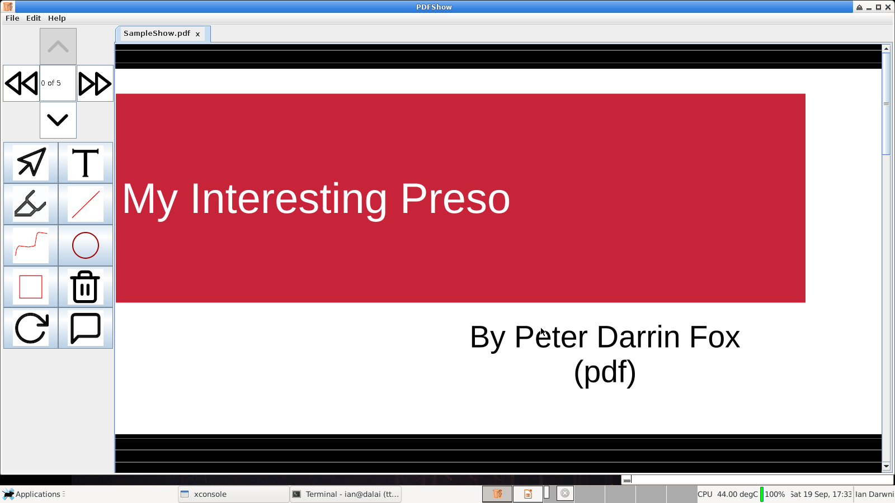

= PdfShow

`PdfShow` is a simple Java Swing-based PDF viewer specifically for running slide shows.
I wrote it because I was tired of general-purpose programs like PDF Annotator and
Adobe Reader, which have too many modes, controls, etc. and aren't really optimized
for showing slide decks.

*Update*:
The dependency for darwinsys-api on maven central has been updated (to 1.5.13, which is published),
so you should not have to build the dependent API. You have only one trivial manual task before building (see below).

`PdfShow` has limitations compared with other tools (see the
https://github.com/IanDarwin/pdfshow/issues[TODO list]), due to
its relative youth and, more importantly, its design goals.
These are (or will be) laid out in the User Guide.

We will add more bells and whistles as time permits.

Pull requests will be gratefully accepted as long as they fit
within the general tone of the program - _minimalist, but functional._

== Installing PdfShow

There may be an installer for your computing platform; see
https://github.com/IanDarwin/pdfshow/releases. Check the latest 
release under the _Assets_ dropdown.

Note that the installers bundle their own Java VM, which they are known
to work with; they are about 50Mb to download and about 120-140Mb when installed.
If you use the source or Jar approach, you have to be sure
you have a JDK that will work with `PdfShow`.

If there's no installer, see <<building>> below.

== Using PdfShow

The program is intuitive and easy to use. Of course they all say that.
Just run it and use `File->Open` (or `CTRL/CMD O`), or run it with a filename argument.
There's a "recent files" menu for subsequent days of your course, for example.
There is more documentation in the `docs` folder.

[[building]]
== Build PdfShow

Download the repository from https://github.com/IanDarwin/pdfshow. 

Using command-line tools:

	git clone https://github.com/IanDarwin/pdfshow
	cd pdfshow

Using Eclipse:

	Window->Show View->Git->Git Repositories.
	In the Repos window, Clone (the third icon at the right side of this window).
	Enter the URL https://github.com/IanDarwin/pdfshow and click Next
	On the next dialog, be sure to check Import Existing Projects before Next.
	PdfShow should show up in the Package Explorer

Before building or running, you need to
copy the file `pdfshow.properties.sample` to `pdfshow.properties`, and edit as per the comments.
*If you miss this step, you will get obscure errors like "Cannot start JVM"!* if you later use the Installers.

	cp src/main/resources/pdfshow.properties.sample src/main/resources/pdfshow.properties
	your_favorite_editor src/main/resources/pdfshow.properties

To test run the program in Eclipse, you can just open 
and run `PdfShow.java`, the main-program file, in Eclipse.
If you use IntelliJ, NetBeans, or some other IDE, you can import and run it.
You can even submit a pull request with that IDE's config files, as long as it doesn't require changing
the directory structure.

To package just the program and its images (without the dependencies),
do `mvn package`.

To make a clickable runnable JAR file, run `mvn package assembly:single`.
You'll then find a `jar` with dependencies in the target folder.
It'll be named something like `pdfshow-1.0.0-SNAPSHOT-jar-with-dependencies.jar`.
You can run it with `java -jar target/pdfshow*dependencies.jar` (see `scripts/pdfshow`), or just click on it in an file
manager window in MS-Windows, macOS, or most *Nix windowed environments.

To make a full-blown, platform-specific installer, we use the `mkinstaller` script.
You can run that yourself if you need to.
Note that on Windows this has pre-requisites, which it will let you know about.

The install formats are:

[[table-name]]
.The Installer Formats
[options="header",cols="2,4,3"]
|====
|OS|Current Format|Other formats in mkinstaller
|macOS|DMG, with copy-to-Applications iconage.|pkg
|Linux|rpm - Redhat/Yum/dnf/Zypher|deb
|Windows|MSI installer|exe
|====

== Development

Fork the repo, clone your forked copy, make changes, test changes, send a pull request.

Q: Why didn't I use this for the drawing:

	PDPageContentStream contentStream = new PDPageContentStream(document, page);
	contentStream.setNonStrokingColor(Color.DARK_GRAY);
	contentStream.addRect(200, 650, 100, 100);

A: The problem is that it would be much harder (if not impossible) to implement Undo processing
when using that approach. Perhaps a later Save PDF function could
insert the GObjects into the PDF using this technique.

Q: Why not use the built-in contains for hit detection?
A: The GObject hierarchy is intentionally light-weight, not JComponent, and
it's gotta be the same amount of work.

== Credits

Program written by Ian Darwin of Rejminet Group Inc.
Contributions by a cast of thousands (someday).

PDF access (i.e., some of the heavy listing!) is done by
https://pdfbox.apache.org/[Apache PDFBox] software.

Some icons from feathericons.com; a few simpler ones icons by Ian Darwin.
