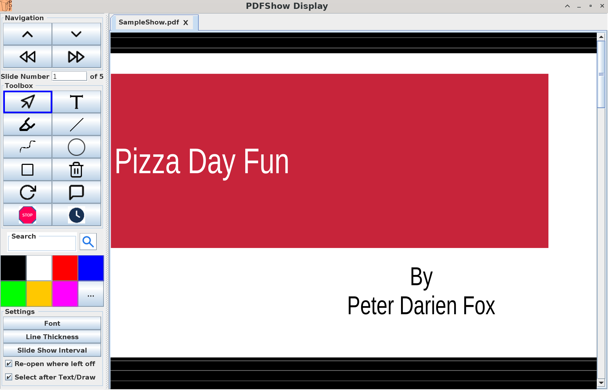
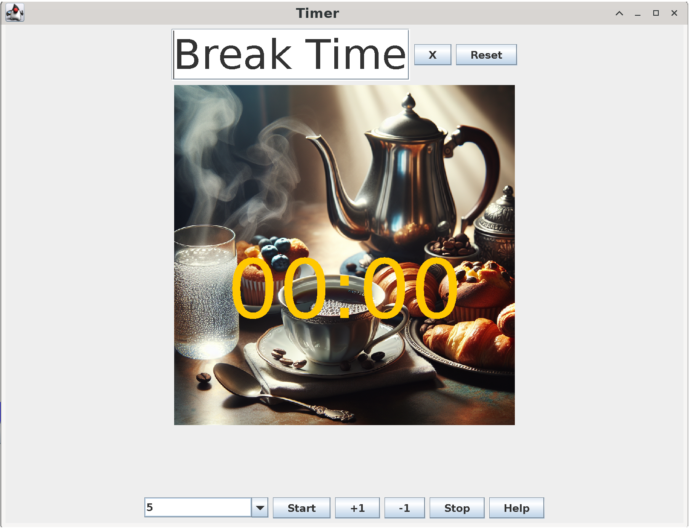

= PdfShow: The Simple PDF Presentation Tool
:author: Ian Darwin

`PdfShow` is a simple Java-based PDF viewer specifically for running slide shows.
If you want to pre-draw fancy diagrams, and save them for re-use each time you present your
slide deck, this is not for you;
use Adobe Reader DC, PDF Annotator, or some other fancier tool.
And if your presentation skills depend on blurry transitions or zippy little animations,
just run your show in KeyNote, LibreOffice or PowerPoint.
However, if you like to scribble all over the slides in your PDF slide deck each time you run your course,
to make the slides come alive, then `PdfShow` may be right for you.

Wait! Who presents from PDFs? *Lots of people!*
Maybe you need to present a talk and you only have the PDF, not the ODP, KeyNote or PPTx file(s).
Some training companies only distribute their courses to instructors as PDFs, 
not presentation-software files.
Or maybe you want to re-give somebody else's preso from the PDF-only version they published online
(if you do this, make sure to ask permission/give credit/respect copyrights+licenses).
Or yet again, maybe you use one of the open-source tools that generates slide-decks in PDF:

* https://staff.fnwi.uva.nl/b.diertens/useful/gpresent/[gpresent],
which doesn't actually present shows but generates the PDF and leaves it to others to present.
* the https://docs.asciidoctor.org/reveal.js-converter/latest/converter/features/[
AsciiDoctor+Reveal.js tooling] which can create PDF slides from AsciiDoc.
* the Markdown-based https://marp.app/[MARP], which can generate PDFs directly from markdown files.
* the MagicPoint-based https://mg.pov.lt/mgp2pdf/[MagicPoint to PDF Converter].

Whatever the reason, when you need to present with just the PDF of the slides,
`PdfShow` is right for you!

This program is free software and may be copied for use without fee.
The source code is https://github.com/IanDarwin/pdfshow[available on my GitHub repository];
if you are a developer and would like to improve it, see the _docs_ directory.
Github pull requests are welcome.

For current improvements (and known bugs), see the link:release-notes.html[release notes].

== Installing it

Downloads are occasionally released on my https://github.com/IanDarwin/pdfshow/releases[GitHub page].

If you already have a Java JDK installed, 
and either have `java` on your path or want to click on a Jar file to run it
or invoke the program with a batch file / shell script, 
pick the `pdfshow`-x.x.x-with-dependencies.jar.

For a full installer (which installs a compatible version of Java along with the app), use:

* the `pdfshow`-x.x.x.dmg file for macOS;
* the `pdfshow`-x.x.x.msi for MS-Windows;
* the `pdfshow`-x.x.x.rpm for dnf/yum/RPM-based Linux Systems (RHEL, Rocky, Fedora, etc;
installs in _/opt/pdfshow_).

I don't have a Deb/Ubuntu Linux to build on at the moment.

[[using_pdfshow]]
== Using PdfShow

On most systems you can start the program from the GUI, or from the command line if you prefer.

This program is intended for slide shows, which are almost always in "landscape mode"
(oriented like a laptop or computer monitor, not upright like a smartphone).
Slide decks will be scaled to fit your monitor, so book-style documents
(portrait mode documents) will appear unusually wide, though still readable.
There is a code issue (https://github.com/IanDarwin/pdfshow/issues/7[Issue#7]) that will improve the scaling.

Like most GUI tools, you can open a file either by passing it on the command line,
via the `File->Open` menu, or via `CTRL`/`CMD`-O.
You can have multiple files open, using the tab selector at the top.
You can drag tabs to change their order in the tabbed pane.

=== Navigation

You can move around within a file using:

* The mouse scroll wheel for rapid work;
* The scroll bar at the right side of the current tab;
* The `Up` and `Down` buttons in the nav box;
* The `Begin` and `End` buttons in the nav box (first and last page).
* Typing a given page number in the page number box in the middle of the nav box;
* Ensuring the mouse is in the window, and using these shortcuts (not all work on all platforms):
** `DownArrow`, `j`, `SPACE`, or `RETURN` to move to the next page;
** `UpArrow`, `k`, `DELETE`, or `BACKSPACE` to move to the previous page.

=== Drawing

There are multiple draw tool icons in the toolbox. 
// Each of these
// only has effect once, that is, you have to click the Line button
// a second time to draw a second line.
The Text button is not sticky; you draw one text and the program reverts to "selection" mode.
The draw line/polyline/oval/rectangle buttons _are_ sticky, that is, to draw two lines, click the line icon, draw one line, then you can draw another without re-clicking the line icon.

Besides Text, the toolbox also has icons for select mode, marking/highlight mode,
straight line, polyline, oval, and rectangle.
Each of these will rubber-band as you draw it, like most draw programs.
The Text icon pops up a dialog for the text; the others just let you draw.
Each graphic object that you attach to a page will stay with that page
until you close the file or exit the application.

You can select the draw tools by clicking, but you can also select them by keyboard shortcuts:

[[draw-shortcuts]]
.Draw Tool Keyboard Shortcuts
[options="header",cols="2,4"]
|====
|s|Select
|t|Text
|m|Marking
|l|Line (straight)
|w|Line (wiggly, a.k.a. PolyLine)
|o|Oval/Circle
|r|Rectangle/Square
|====

The Undo button (or CTRL/Z CMD/Z) removes the most-recently added graphic each time it's pressed.
To delete an arbitrary graphic, click the `Select` icon then select the item
you want to get rid of, then either use the `Delete` key (if it's not mapped to
VK_UP as it is on some systems) or use the `Edit->Delete Selected` menu item.
The Trash Can icon is the most drastic: it removes *all* graphics from the current page.
There's no undo for this at the moment.

Items that you draw are _not_ saved on disk, since that would go against the 
"make your slides come alive" mantra.
But I am open to well-reasoned arguments in favor of saving them into the PDF,
especially if accompanied by a "pull request" containing working code.

=== Break Timer

The break timer is activated from the View menu or from the "clock" button in the toolbox.
Set the time you want in the drop-down/textbox at the bottom, and press Start
to show the count-down window.
The window can be resized, moved, etc., in case you need to refer back to the slides
(as is the case when a student asks a question when on a long break).
Just remember to bring the timer window back to the front when finished!

The Break Timer will choose one of several break-related theme photos to use as a background.
If you'd like to add your own, create a directory in your home directory
named _.pdfshow/images_, and name the image files _break-background**N**.png_, where 'N' is
a single digit from 1 to 9. Other files will be ignored. Since the selection is random,
it may choose your images or the built-in ones, on a per-run basis.
That is, you may get one image all day, but you'll (probably!) get a different one tomorrow.

=== One or Two Monitors

If you have one monitor, you get the standard view window.
If you have two, you can try the -2 argument when starting the program;
this will put the control screen on the first monitor
and take the second monitor entirely for the slideshow.

* You can't draw on the miniature view (yet?), and it doesn't show your drawings.
* If you unplug the second monitor, you have to re-start PDFshow, but that shouldn't be a problem.

=== Auto Show Mode

There are two modes for auto-presenting, which I call "across" and "down".
Across mode goes across all the tabs, showing the current slide from each.
This might be useful when, for example, the training company provides a standard
slide deck that you have to use, but you want a show alternating between their opening slide
and your own informational slide during the pre-class period.
That's the use case I designed it for, but your mileage may vary.

"Down" mode is normal slide show mode - run through all the slides in one tab.

For both modes, there is a single "Interval time" setting, which controls the speed
of both modes, and takes effect on the next slide if changed during a show.
The "Stop slide" button is at the bottom left, below the Settings.

=== Settings

There is a Settings section in the lower part of the left-hand pane.
There is a color bar with 7 predefined colors but the 8th space is a color chooser.
There are pop up dialogs to choose a font and to set the drawing line thickness.
 
The "Open at last-used page" is for the case where a slideshow takes more than one day,
and your computer gets shut down overnight; in the morning when you open the file again
it will resume where you left off. This behaviour is true by default.

== Credits

See the top-level README file for code credits.
